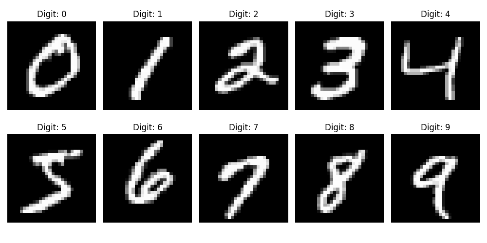
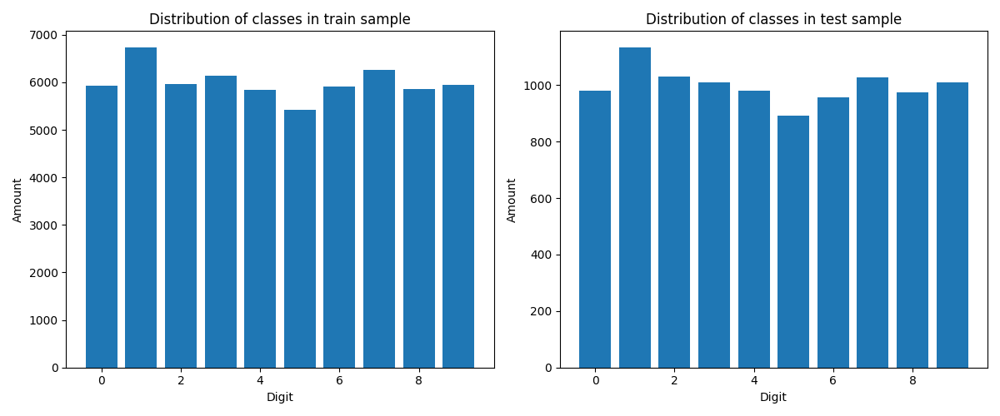
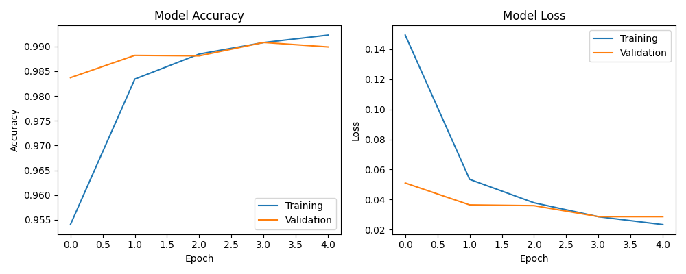

# MNIST Handwritten Digit Recognition with TFLite

A graphical application for handwritten digit recognition based on the MNIST dataset with model training and TensorFlow Lite export capabilities.

## 🚀 Features

- **Data Visualization**: View digit examples and class distribution from MNIST dataset
- **Model Training**: CNN training for digit recognition with real-time training visualization
- **Interactive Recognition**: Draw digits and get instant predictions
- **TFLite Export**: Convert models to Float32 and Int8 formats
- **Model Comparison**: Analyze accuracy and size of different model formats
- **Performance Testing**: Measure inference speed across model formats
- **Model Loading**: Load existing TFLite models for testing

## 📊 Results

### Model Accuracy
```
Original Keras: 0.9885
TFLite Float32: 0.9885
TFLite Int8: 0.9884
```

### Model Sizes
```
Keras: 2.61 MB
TFLite Float32: 0.86 MB (3x compression)
TFLite Int8: 0.22 MB (11x compression)
```

### Performance (ms per prediction)
```
Keras: 36.547 ms
TFLite Float32: 0.059 ms (615x faster)
TFLite Int8: 0.028 ms (1314x faster)
```

## 🖼️ Visualizations

### MNIST Dataset Examples


### Class Distribution


### Training History


## 🛠️ Installation

1. Clone the repository:
```bash
git clone <repository-url>
cd TFLite
```

2. Create virtual environment:
```bash
python3 -m venv venv
source venv/bin/activate  # Linux/Mac
# or
venv\Scripts\activate     # Windows
```

3. Install dependencies:
```bash
pip install -r requirements.txt
```

## 🚀 Running

```bash
python main.py
```

## 📖 Usage

### 1. Data Visualization
- **MNIST Examples**: Browse digit examples from the dataset
- **Class Distribution**: Analyze class distribution in training and test sets

### 2. Model Training
- Set epochs and batch size
- Click "Start Training" to train the CNN model
- Monitor accuracy and loss graphs in real-time

### 3. Drawing & Recognition
- On "Draw & Predict" tab, draw digits with mouse
- Model instantly predicts the digit and shows probabilities for each class

### 4. TFLite Export
- **Export Float32 TFLite**: Convert to standard TFLite format
- **Export Int8 TFLite**: Quantize to 8-bit format for maximum optimization
- **Compare Models**: Compare accuracy and size across all formats
- **Performance Test**: Measure inference speed of all models

### 5. Model Loading
- **Load TFLite Model**: Load existing TFLite model for testing

## 📁 Project Structure

```
TFLite/
├── assets/                    # Charts and results
│   ├── mnist_examples.png
│   ├── class_distribution.png
│   ├── training_history.png
│   ├── tflite_comparison_results.txt
│   └── performance_test_results.txt
├── models/                    # Keras models (.keras)
├── tflite_models/             # TFLite models (.tflite)
├── src/                       # Source code
│   ├── data_utils.py          # Data loading and visualization
│   ├── model_utils.py         # Model creation and training
│   ├── drawing_canvas.py      # Drawing interface
│   └── tflite_utils.py        # TFLite operations
├── main.py                    # Main application file
├── requirements.txt           # Dependencies
└── README.md                  # Documentation
```

## 📋 Requirements

- Python 3.8+
- TensorFlow 2.10+
- NumPy
- Matplotlib
- Pillow (PIL)
- Tkinter (usually included with Python)

## 🔧 Model Architecture

CNN with the following architecture:
- Conv2D (32 filters, 3x3) + ReLU + MaxPooling (2x2)
- Conv2D (64 filters, 3x3) + ReLU + MaxPooling (2x2)
- Flatten + Dense (128) + ReLU + Dropout (0.2)
- Dense (10) + Softmax

## 📈 Performance Metrics

### Model Format Comparison:
- **Float32**: Minimal accuracy loss, good speed
- **Int8**: Maximum size and speed optimization, slight accuracy loss

### Test Results:
- Accuracy maintained at 98.8% even after quantization
- Model size reduced by 11x
- Inference speed increased by 1300x+
